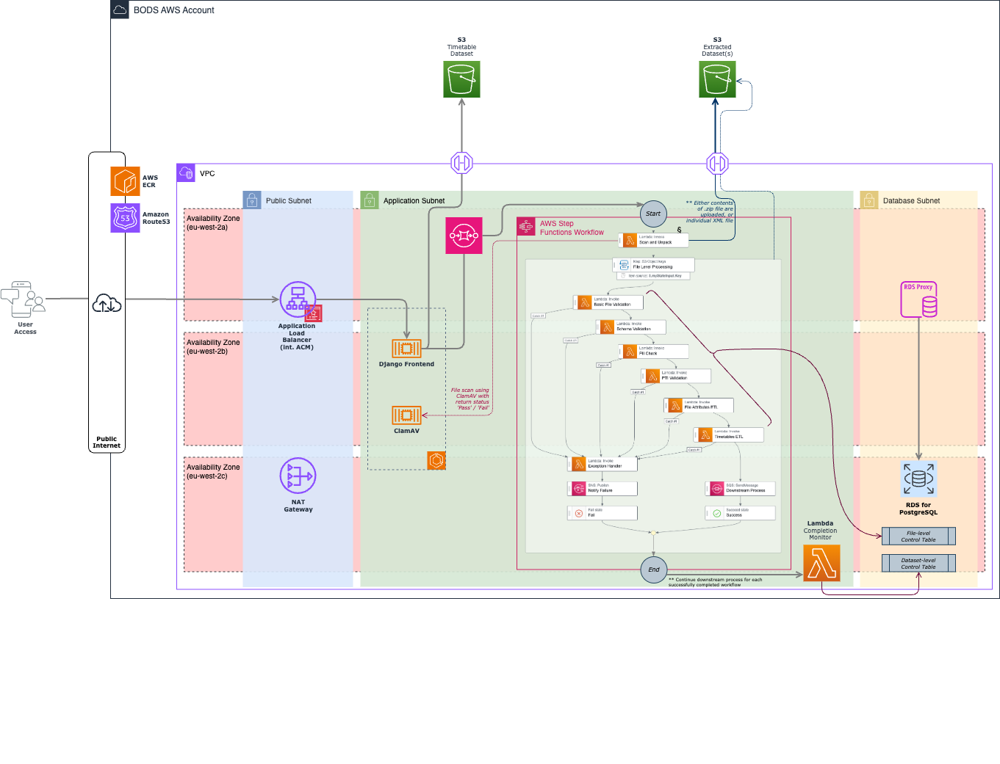

# BODS Backend

Repository relating to the Bus Open Data service that is offerred by DfT (Department for Transport), more specifically the backend lambda functions. 
This covers both periodic tasks that would typically be run using CeleryWorker, and more intensive processes like Timetables ETL.

The architecture for ETL is as below -

## Category

Supporting application lambda processes

## Tech Stack
 - Docker
 - PostgreSQL
 - Python
 - AWS LocalStack
 - AWS SAM (Serverless Application Model)

## Links
- [Bus Open Data Service Application](https://github.com/department-for-transport-BODS/bods)

  GitHub repository containing code relating to the associated application services for BODS.

- [LocalStack](./localstack/)

  Scripts associated with the localstack instance that is used for end-to-end testing of various services.

- [Initial Setup](./docs/setup.md)

  Documentation relating to the initial set up of a local testing environment, and how to execute code examples.

## Documentation

[Link to Confluence Page](https://kpmgengineering.atlassian.net/wiki/spaces/BODS/overview?homepageId=393576772)
[Sharepoint](https://kpmgoneuk.sharepoint.com/sites/GB-Bus_Open_Data_service)

## Useful Links

 - [Reusable Actions](https://github.com/KPMG-UK/pcoe-eng-github-actions-library)
 - [DPP Engineering Documentation](https://kpmgengineering.atlassian.net/wiki/spaces/DPPENG/overview?homepageId=352288946)
 - [Raise a request(CE/PE Portal)](https://kpmgengineering.atlassian.net/servicedesk/customer/portal/1/group/-1)